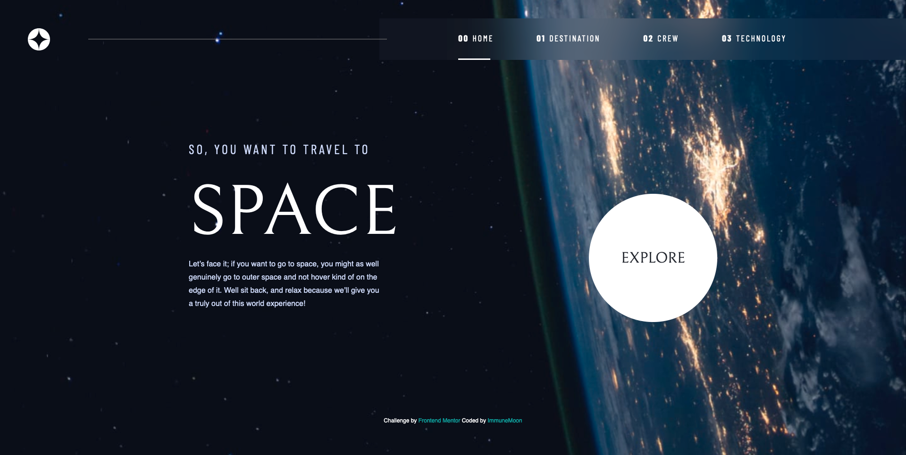

# Frontend Mentor - Space tourism website solution

This is a solution to the [Space tourism website challenge on Frontend Mentor](https://www.frontendmentor.io/challenges/space-tourism-multipage-website-gRWj1URZ3). Frontend Mentor challenges help you improve your coding skills by building realistic projects.

## Table of contents

- [Overview](#overview)
  - [The challenge](#the-challenge)
  - [Screenshot](#screenshot)
  - [Links](#links)
- [My process](#my-process)
  - [Built with](#built-with)
  - [What I learned](#what-i-learned)
  - [Continued development](#continued-development)
- [Author](#author)

## Overview

### The challenge

Users should be able to:

- View the optimal layout for each of the website's pages depending on their device's screen size
- See hover states for all interactive elements on the page
- View each page and be able to toggle between the tabs to see new information

### Screenshot

### Links

- Solution URL: [Add solution URL here](https://www.frontendmentor.io/solutions/responsive-multipage-space-tourism-site-wreact-tpsOReMBvy)
- Live Site URL: [Add live site URL here](https://immunemoon.github.io/space-tourism-website/)

## My process

This entire project was a learning process, I used it as a way to teach myself react during my freetime. I began by researching how to create react projects on youtube, stack overflow and many specialized sources, too many to list, to get the project off the ground and help guide me through development. The rest was simply using my previous experience in web development to craft and shape the site over time.

### Built with

- Semantic HTML5 markup
- CSS custom properties
- Flexbox
- CSS Grid
- Mobile-first workflow
- [React](https://reactjs.org/) - JS library
- [Next.js](https://nextjs.org/) - React framework
- [React Router](https://reactrouter.com/en/main) - React Page Router
- [Styled Components](https://styled-components.com/) - For JS based styles

### What I learned

I learned how to use the react library, as well as many useful 3rd party tools that helped make me not want to pull my hair out and go bald before 30.

### Continued development

I would like to work on some simpler react projects to help hammer in the foundations. This project was fun, but probably a lot for my first time using this library. Unfortunately, I favor the deepend mentality.

## Author

- Website - [Alex Page](https://immunemoon.github.io/Portfolio/)
- Frontend Mentor - [@ImmuneMoon](https://www.frontendmentor.io/profile/ImmuneMoon)
